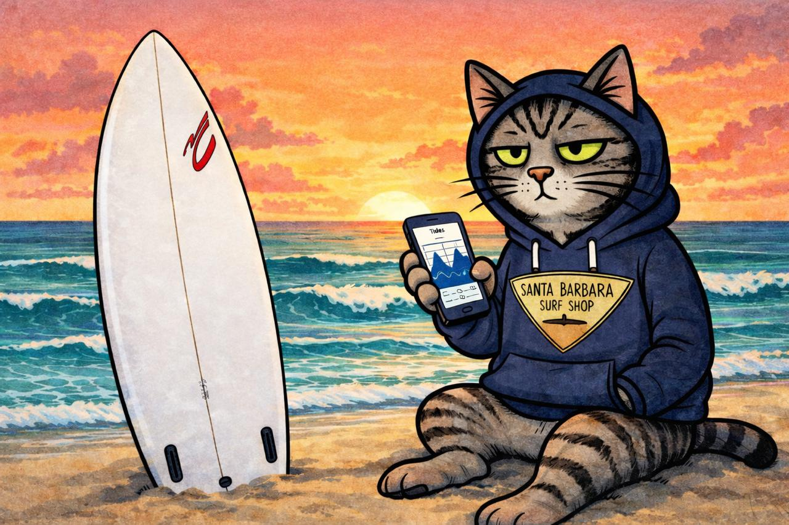
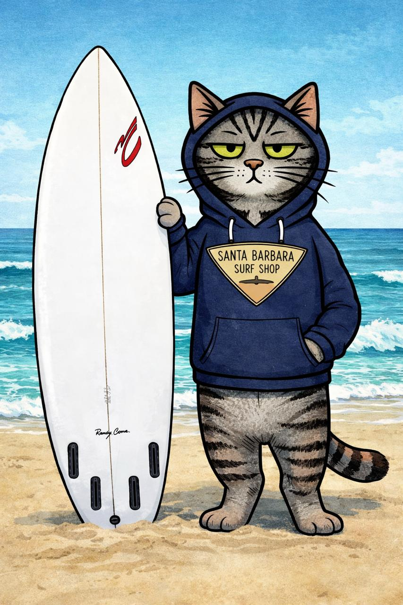
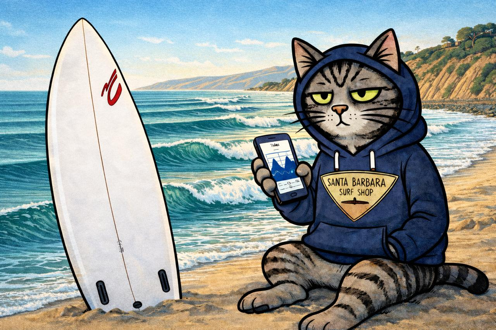
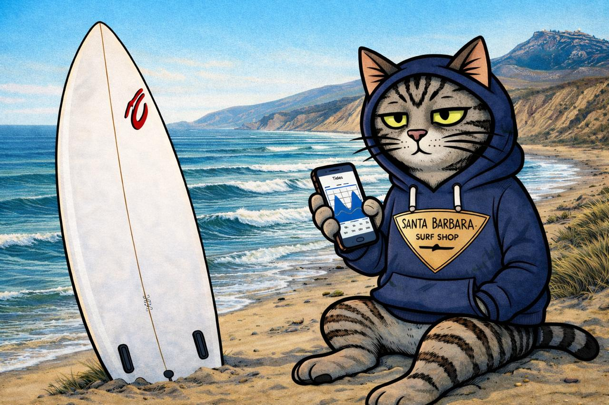
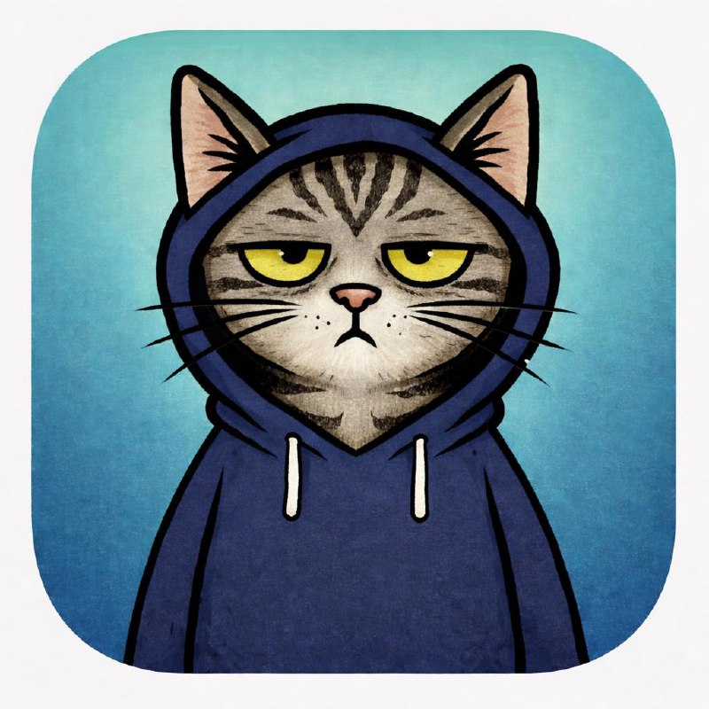

<p align="center">
  
</p>

<p align="center">
  
</p>

<p align="center">
  <em>The funky cool tide app that the cool cats use.</em><br>
  Built by <a href="https://github.com/ezcoder">Ben Williamson</a>, his daughter Odette, and their cat Rip.
</p>

---

## What Is It?

RipCat is a tide prediction tool powered by NOAA data. It finds your nearest tide station, fetches predictions, and renders beautiful tide charts — from the command line or native apps.

<p align="center">
  
</p>

- 🐱 **Free CLI** — open source, free as in beer
- 📱 **iOS App** — tide predictions, charts, and themes on your phone
- ⌚ **watchOS App** — next high/low at a glance
- 🖥️ **macOS App** — full predictions with menu bar widget
- 💰 **Paid apps are cheap** — easier to buy than build

## The Crew

**Rip** is a grey tabby with a touch of brown who's seen bigger waves and is not impressed. He checks the tides from his favorite spots along the Santa Barbara coast — and he always knows when the next set is coming.

His board is shaped by **Randy Cone**, Mavericks legend and Ben's shaper for 34 years. His hoodie is from the **Santa Barbara Surf Shop** — surfboards by Yater since 1962.

---

## Spots

<table>
<tr>
<td align="center" width="50%">
<br>
<strong>Rincon</strong> — Queen of the Coast
</td>
<td align="center" width="50%">
<br>
<strong>Jalama</strong> — Raw Pacific power
</td>
</tr>
</table>

---

## Install & Build

```bash
git clone https://github.com/ezcoder/ripcat.git
cd ripcat
swift build
```

The CLI binary lands at `.build/debug/ripcat`.

## Usage

```bash
# By city name
ripcat --city "Santa Barbara, CA"

# By coordinates
ripcat --lat 34.4208 --lon -119.6982

# Text output instead of JSON
ripcat --city "Santa Barbara, CA" --format text

# Generate a tide chart
ripcat --city "Santa Barbara, CA" --chart tides.png --theme nautical --current
```

### Chart Themes

`light` · `dark` · `coastal` · `nautical`

---

## Project Structure

<p align="center">
  
</p>

```
Sources/
├── RipCatCore/      # Shared tide engine library (MIT)
├── ripcat-cli/      # Free CLI executable
├── RipCatApp/       # iOS app (SwiftUI)
├── RipCatWatch/     # watchOS app (SwiftUI)
└── RipCatMac/       # macOS app (SwiftUI)
```

**RipCatCore** is a standalone Swift library with no CLI dependencies — it powers every target. The CLI is free and open source. The native apps add beautiful UI, widgets, complications, and notifications.

## Architecture

RipCat follows a shared-core monorepo pattern:

- **RipCatCore** — MIT licensed, no platform-specific dependencies. Handles NOAA API, tide calculations, station finding, geocoding, chart rendering. Community contributions welcome.
- **ripcat-cli** — MIT licensed. Thin wrapper around RipCatCore using Swift ArgumentParser.
- **Native apps** — Proprietary SwiftUI interfaces. iOS, watchOS, macOS. Available on the App Store for the price of a coffee.

## Partnerships

<table>
<tr>
<td align="center" width="50%">
<strong>Santa Barbara Surf Shop</strong><br>
<em>Surfboards by Yater since 1962</em><br>
Rip's official hoodie supplier.
</td>
<td align="center" width="50%">
<strong>Randy Cone Surfboards</strong><br>
<em>Mavericks legend. 34 years of shapes.</em><br>
Rip's board of choice.
</td>
</tr>
</table>

## Domains

- [ripcat.dev](https://ripcat.dev)
- [ripcat.com](https://ripcat.com)
- [ripcat.store](https://ripcat.store)

## License

**RipCatCore + CLI** — MIT. See [LICENSE](LICENSE).

**Native apps** — Proprietary. The source is here so you can build them yourself, but the App Store versions support development.

## Contributing

See [CONTRIBUTING.md](CONTRIBUTING.md). Contributions to RipCatCore are welcome and may be used in the paid apps (MIT license). 🌊

---

<p align="center">
  <br>
  <em>Know your tides. Catch more waves.</em>
</p>
